# Database Design Document
## IT Asset Lifecycle Management & Workflow Platform

Version 0.1 — Phase 2 deliverable (pre-implementation)

---

## Table of Contents

1. [Design Principles](#1-design-principles)
2. [ER Diagram](#2-er-diagram)
3. [Schema Overview](#3-schema-overview)
4. [Table Definitions](#4-table-definitions)
   - [Identity Context](#41-identity-context)
   - [People Context](#42-people-context)
   - [Asset Registry Context](#43-asset-registry-context)
   - [Workflow Context](#44-workflow-context)
   - [Assessment & Repair Context](#45-assessment--repair-context)
   - [Disposal Context](#46-disposal-context)
   - [Audit Context](#47-audit-context)
   - [Notification Context](#48-notification-context)
   - [Compliance Context](#49-compliance-context)
   - [File Storage](#410-file-storage)
5. [Normalization Analysis](#5-normalization-analysis)
6. [Index Strategy](#6-index-strategy)
7. [Constraints Summary](#7-constraints-summary)

---

## 1. Design Principles

These apply globally and are not repeated per-table:

| Principle | Implementation |
|---|---|
| **UUIDs for business PKs** | All business entity tables use `UUID` primary keys generated server-side (`gen_random_uuid()`). Prevents enumeration attacks, simplifies data import. Exception: `audit_logs` uses `BIGINT GENERATED ALWAYS AS IDENTITY` for monotonic ordering (hash-chain verification). |
| **UTC timestamps** | Every timestamp column is `TIMESTAMPTZ`, stored in UTC. The application and frontend handle timezone conversion for display. |
| **Optimistic locking** | Tables subject to concurrent writes (`assets`, `workflow_instances`) carry a `version INTEGER NOT NULL DEFAULT 1` column, incremented on every update. The application checks `WHERE version = :expected` on UPDATE. |
| **Soft deletes via status** | No `deleted_at` column. Assets use the `disposed` status; employees use `employment_status`; workflow instances use the `cancelled` status. Records are never physically deleted (audit trail requirement). |
| **Denormalization budget** | A small, deliberate set of denormalized fields exists (documented per-table with rationale). All other data is in 3NF or higher. |
| **Column naming** | `snake_case` everywhere. Foreign keys named `<referenced_table_singular>_id`. Boolean columns prefixed `is_` or `has_`. |
| **Default timestamps** | `created_at TIMESTAMPTZ NOT NULL DEFAULT now()` on every table. `updated_at TIMESTAMPTZ NOT NULL DEFAULT now()` on mutable tables (updated via trigger or application). |
| **NOT NULL by default** | Columns are NOT NULL unless the business domain genuinely allows absence (documented with "nullable — reason"). |

---

## 2. ER Diagram

The diagram uses Mermaid syntax. Relationships use crow's-foot notation:
`||--o{` = one-to-many, `||--||` = one-to-one, `}o--o{` = many-to-many.

```mermaid
erDiagram
    %% ===================== IDENTITY CONTEXT =====================
    roles {
        UUID id PK
        VARCHAR name UK
        VARCHAR description
        BOOLEAN is_system
        TIMESTAMPTZ created_at
    }

    permissions {
        UUID id PK
        VARCHAR code UK
        VARCHAR description
        VARCHAR resource
        VARCHAR action
        TIMESTAMPTZ created_at
    }

    role_permissions {
        UUID role_id FK
        UUID permission_id FK
    }

    users {
        UUID id PK
        VARCHAR email UK
        VARCHAR password_hash
        VARCHAR first_name
        VARCHAR last_name
        UUID role_id FK
        BOOLEAN is_active
        TIMESTAMPTZ last_login_at
        TIMESTAMPTZ created_at
        TIMESTAMPTZ updated_at
    }

    refresh_tokens {
        UUID id PK
        UUID user_id FK
        VARCHAR token_hash UK
        TIMESTAMPTZ expires_at
        BOOLEAN is_revoked
        VARCHAR device_info
        INET ip_address
        TIMESTAMPTZ created_at
    }

    roles ||--o{ users : "assigned to"
    roles ||--o{ role_permissions : "has"
    permissions ||--o{ role_permissions : "granted via"
    users ||--o{ refresh_tokens : "owns"

    %% ===================== REFERENCE DATA =====================
    departments {
        UUID id PK
        VARCHAR name UK
        UUID parent_department_id FK
        BOOLEAN is_active
        TIMESTAMPTZ created_at
    }

    offices {
        UUID id PK
        VARCHAR name UK
        VARCHAR address
        VARCHAR city
        BOOLEAN is_active
        TIMESTAMPTZ created_at
    }

    device_types {
        UUID id PK
        VARCHAR name UK
        BOOLEAN is_active
        TIMESTAMPTZ created_at
    }

    brands {
        UUID id PK
        VARCHAR name UK
        BOOLEAN is_active
        TIMESTAMPTZ created_at
    }

    vendors {
        UUID id PK
        VARCHAR name
        VARCHAR contact_email
        VARCHAR contact_phone
        VARCHAR address
        BOOLEAN is_active
        TIMESTAMPTZ created_at
        TIMESTAMPTZ updated_at
    }

    %% ===================== PEOPLE CONTEXT =====================
    employees {
        UUID id PK
        VARCHAR employee_code UK
        UUID user_id FK
        VARCHAR first_name
        VARCHAR last_name
        VARCHAR email UK
        UUID department_id FK
        VARCHAR designation
        UUID manager_id FK
        UUID office_id FK
        VARCHAR employment_status
        TIMESTAMPTZ hire_date
        TIMESTAMPTZ termination_date
        TIMESTAMPTZ created_at
        TIMESTAMPTZ updated_at
    }

    users ||--o| employees : "linked to"
    departments ||--o{ employees : "belongs to"
    offices ||--o{ employees : "located at"
    employees ||--o{ employees : "reports to"

    %% ===================== ASSET REGISTRY =====================
    assets {
        UUID id PK
        VARCHAR asset_tag UK
        VARCHAR serial_number UK
        VARCHAR imei
        UUID device_type_id FK
        UUID brand_id FK
        VARCHAR model
        VARCHAR status
        UUID current_holder_id FK
        UUID department_id FK
        UUID office_id FK
        NUMERIC purchase_amount
        VARCHAR purchase_currency
        DATE purchase_date
        UUID vendor_id FK
        DATE warranty_expiry_date
        VARCHAR notes
        INTEGER version
        TIMESTAMPTZ created_at
        TIMESTAMPTZ updated_at
    }

    device_types ||--o{ assets : "categorizes"
    brands ||--o{ assets : "manufactured by"
    vendors ||--o{ assets : "supplied by"
    departments ||--o{ assets : "assigned to"
    offices ||--o{ assets : "located at"
    employees |o--o{ assets : "holds"

    asset_accessories {
        UUID id PK
        UUID asset_id FK
        VARCHAR name
        VARCHAR serial_number
        VARCHAR condition
        VARCHAR notes
        TIMESTAMPTZ created_at
    }

    assets ||--o{ asset_accessories : "includes"

    asset_status_history {
        UUID id PK
        UUID asset_id FK
        VARCHAR from_status
        VARCHAR to_status
        UUID changed_by_id FK
        VARCHAR reason
        UUID workflow_instance_id FK
        TIMESTAMPTZ changed_at
    }

    assets ||--o{ asset_status_history : "tracks"
    users ||--o{ asset_status_history : "changed by"

    acquisitions {
        UUID id PK
        UUID asset_id FK
        DATE purchase_date
        UUID vendor_id FK
        NUMERIC purchase_amount
        VARCHAR purchase_currency
        VARCHAR invoice_number
        UUID facilitated_by_id FK
        VARCHAR condition_on_receipt
        VARCHAR warranty_terms
        VARCHAR notes
        TIMESTAMPTZ created_at
    }

    assets ||--|| acquisitions : "acquired via"
    vendors ||--o{ acquisitions : "sold by"
    users ||--o{ acquisitions : "facilitated by"

    %% ===================== WORKFLOW CONTEXT =====================
    workflow_definitions {
        UUID id PK
        VARCHAR name UK
        VARCHAR code UK
        TEXT description
        INTEGER version
        BOOLEAN is_active
        TIMESTAMPTZ created_at
        TIMESTAMPTZ updated_at
    }

    workflow_stages {
        UUID id PK
        UUID workflow_definition_id FK
        VARCHAR name
        VARCHAR code
        INTEGER stage_order
        VARCHAR stage_type
        UUID required_role_id FK
        BOOLEAN requires_signature
        INTEGER sla_hours
        JSONB validation_rules
        JSONB on_complete_actions
        TIMESTAMPTZ created_at
    }

    workflow_definitions ||--o{ workflow_stages : "composed of"
    roles ||--o{ workflow_stages : "required"

    workflow_instances {
        UUID id PK
        UUID workflow_definition_id FK
        VARCHAR reference_type
        UUID reference_id
        UUID current_stage_id FK
        VARCHAR status
        BOOLEAN is_bypassed
        UUID created_by_id FK
        TIMESTAMPTZ completed_at
        INTEGER version
        TIMESTAMPTZ created_at
        TIMESTAMPTZ updated_at
    }

    workflow_definitions ||--o{ workflow_instances : "instantiated as"
    workflow_stages ||--o{ workflow_instances : "currently at"
    users ||--o{ workflow_instances : "initiated by"

    workflow_transitions {
        UUID id PK
        UUID workflow_instance_id FK
        UUID from_stage_id FK
        UUID to_stage_id FK
        UUID performed_by_id FK
        VARCHAR reason
        JSONB signature_data
        JSONB payload
        BOOLEAN is_bypass
        TIMESTAMPTZ performed_at
    }

    workflow_instances ||--o{ workflow_transitions : "records"
    workflow_stages ||--o{ workflow_transitions : "from"
    workflow_stages ||--o{ workflow_transitions : "to"
    users ||--o{ workflow_transitions : "performed by"

    allocation_requests {
        UUID id PK
        UUID employee_id FK
        VARCHAR request_type
        VARCHAR justification
        UUID requested_asset_id FK
        UUID selected_asset_id FK
        UUID workflow_instance_id FK
        VARCHAR status
        TIMESTAMPTZ created_at
        TIMESTAMPTZ updated_at
    }

    employees ||--o{ allocation_requests : "requests"
    assets |o--o{ allocation_requests : "requested"
    assets |o--o{ allocation_requests : "selected"
    workflow_instances ||--o| allocation_requests : "governs"

    return_records {
        UUID id PK
        UUID employee_id FK
        UUID workflow_instance_id FK
        VARCHAR reason
        VARCHAR status
        VARCHAR damage_notes
        TIMESTAMPTZ created_at
        TIMESTAMPTZ updated_at
    }

    employees ||--o{ return_records : "returns from"
    workflow_instances ||--o| return_records : "governs"

    return_items {
        UUID id PK
        UUID return_record_id FK
        UUID asset_id FK
        VARCHAR condition
        BOOLEAN is_returned
        VARCHAR missing_items
        VARCHAR notes
    }

    return_records ||--o{ return_items : "contains"
    assets ||--o{ return_items : "being returned"

    %% ===================== ASSESSMENT & REPAIR =====================
    assessment_records {
        UUID id PK
        UUID asset_id FK
        UUID assessed_by_id FK
        UUID workflow_instance_id FK
        VARCHAR disposition
        TEXT technician_notes
        TIMESTAMPTZ assessed_at
        TIMESTAMPTZ created_at
    }

    assets ||--o{ assessment_records : "assessed in"
    users ||--o{ assessment_records : "assessed by"
    workflow_instances |o--o{ assessment_records : "part of"

    assessment_checklist_items {
        UUID id PK
        UUID assessment_record_id FK
        VARCHAR component
        VARCHAR status
        VARCHAR notes
    }

    assessment_records ||--o{ assessment_checklist_items : "contains"

    repair_records {
        UUID id PK
        UUID asset_id FK
        UUID reported_by_id FK
        VARCHAR fault_description
        UUID assigned_technician_id FK
        UUID vendor_id FK
        VARCHAR repair_status
        NUMERIC cost
        VARCHAR cost_currency
        UUID workflow_instance_id FK
        DATE estimated_completion
        TIMESTAMPTZ completed_at
        TIMESTAMPTZ created_at
        TIMESTAMPTZ updated_at
    }

    assets ||--o{ repair_records : "repaired in"
    users ||--o{ repair_records : "reported by"
    users |o--o{ repair_records : "assigned to"
    vendors |o--o{ repair_records : "serviced by"
    workflow_instances |o--o{ repair_records : "governs"

    %% ===================== DISPOSAL =====================
    disposal_records {
        UUID id PK
        UUID asset_id FK
        VARCHAR reason
        UUID requested_by_id FK
        UUID approved_by_id FK
        UUID workflow_instance_id FK
        VARCHAR status
        VARCHAR method
        TEXT evidence_notes
        TIMESTAMPTZ approved_at
        TIMESTAMPTZ disposed_at
        TIMESTAMPTZ created_at
    }

    assets ||--o{ disposal_records : "disposed via"
    users ||--o{ disposal_records : "requested by"
    users |o--o{ disposal_records : "approved by"
    workflow_instances |o--o{ disposal_records : "governs"

    %% ===================== AUDIT =====================
    audit_logs {
        BIGINT id PK
        VARCHAR hash
        VARCHAR previous_hash
        UUID user_id FK
        VARCHAR user_email
        VARCHAR action
        VARCHAR resource_type
        VARCHAR resource_id
        JSONB old_value
        JSONB new_value
        INET ip_address
        VARCHAR user_agent
        JSONB metadata
        TIMESTAMPTZ timestamp
    }

    users |o--o{ audit_logs : "performed by"

    %% ===================== NOTIFICATIONS =====================
    notification_templates {
        UUID id PK
        VARCHAR code UK
        VARCHAR subject_template
        TEXT body_template
        TIMESTAMPTZ created_at
        TIMESTAMPTZ updated_at
    }

    notification_rules {
        UUID id PK
        VARCHAR event_type
        VARCHAR workflow_type
        VARCHAR stage_code
        VARCHAR recipient_strategy
        UUID recipient_role_id FK
        UUID template_id FK
        VARCHAR priority
        BOOLEAN is_active
        TIMESTAMPTZ created_at
    }

    notification_templates ||--o{ notification_rules : "renders with"
    roles |o--o{ notification_rules : "targets"

    notifications {
        UUID id PK
        UUID recipient_id FK
        UUID notification_rule_id FK
        VARCHAR channel
        VARCHAR subject
        TEXT body
        VARCHAR delivery_status
        BOOLEAN is_read
        VARCHAR reference_type
        UUID reference_id
        TIMESTAMPTZ read_at
        TIMESTAMPTZ created_at
    }

    users ||--o{ notifications : "receives"
    notification_rules ||--o{ notifications : "generated by"

    notification_preferences {
        UUID id PK
        UUID user_id FK
        VARCHAR event_category
        VARCHAR delivery_method
        TIMESTAMPTZ updated_at
    }

    users ||--o{ notification_preferences : "prefers"

    email_deliveries {
        UUID id PK
        UUID notification_id FK
        VARCHAR recipient_email
        VARCHAR subject
        VARCHAR status
        INTEGER attempts
        TIMESTAMPTZ last_attempt_at
        TEXT error_message
        TIMESTAMPTZ sent_at
        TIMESTAMPTZ created_at
    }

    notifications ||--o| email_deliveries : "delivered via"

    %% ===================== COMPLIANCE =====================
    compliance_breaches {
        UUID id PK
        UUID workflow_instance_id FK
        UUID workflow_stage_id FK
        INTEGER sla_hours
        INTEGER actual_hours
        BOOLEAN is_escalated
        UUID escalated_to_id FK
        TIMESTAMPTZ breached_at
        TIMESTAMPTZ resolved_at
        TIMESTAMPTZ created_at
    }

    workflow_instances ||--o{ compliance_breaches : "breached in"
    workflow_stages ||--o{ compliance_breaches : "at stage"
    users |o--o{ compliance_breaches : "escalated to"

    %% ===================== FILE STORAGE =====================
    file_references {
        UUID id PK
        VARCHAR reference_type
        UUID reference_id
        VARCHAR file_name
        VARCHAR mime_type
        BIGINT file_size
        VARCHAR storage_key
        UUID uploaded_by_id FK
        TIMESTAMPTZ created_at
    }

    users ||--o{ file_references : "uploaded by"
```

---

## 3. Schema Overview

**35 tables** organized by bounded context:

| Context | Tables | Count |
|---|---|---|
| Identity | `roles`, `permissions`, `role_permissions`, `users`, `refresh_tokens` | 5 |
| Reference Data | `departments`, `offices`, `device_types`, `brands`, `vendors` | 5 |
| People | `employees` | 1 |
| Asset Registry | `assets`, `asset_accessories`, `asset_status_history`, `acquisitions` | 4 |
| Workflow Engine | `workflow_definitions`, `workflow_stages`, `workflow_instances`, `workflow_transitions` | 4 |
| Allocation | `allocation_requests` | 1 |
| Return | `return_records`, `return_items` | 2 |
| Assessment | `assessment_records`, `assessment_checklist_items` | 2 |
| Repair | `repair_records` | 1 |
| Disposal | `disposal_records` | 1 |
| Audit | `audit_logs` | 1 |
| Notification | `notification_templates`, `notification_rules`, `notifications`, `notification_preferences`, `email_deliveries` | 5 |
| Compliance | `compliance_breaches` | 1 |
| File Storage | `file_references` | 1 |
| **Total** | | **34** |

---

## 4. Table Definitions

### 4.1 Identity Context

---

#### `roles`

**Why it exists:** Stores the system's role definitions. Roles are the unit of RBAC — every user has exactly one role, and each role maps to a set of permissions. Separated from `users` because the role→permission mapping is shared across all users of that role (many-to-many via `role_permissions`), and the five roles defined in the spec may expand in future versions.

| Column | Type | Constraints | Description |
|---|---|---|---|
| `id` | `UUID` | `PK, DEFAULT gen_random_uuid()` | Unique identifier |
| `name` | `VARCHAR(50)` | `NOT NULL, UNIQUE` | Human-readable name: `Super Admin`, `Stores Officer`, `IT Representative`, `P&C`, `Employee` |
| `description` | `VARCHAR(255)` | `NOT NULL` | Purpose of the role |
| `is_system` | `BOOLEAN` | `NOT NULL DEFAULT true` | System-defined roles cannot be deleted |
| `created_at` | `TIMESTAMPTZ` | `NOT NULL DEFAULT now()` | |
| `updated_at` | `TIMESTAMPTZ` | `NOT NULL DEFAULT now()` | |

---

#### `permissions`

**Why it exists:** Stores fine-grained action definitions (e.g., `asset:create`, `allocation:review`). Separated from roles to support a many-to-many relationship — different roles may share some permissions but not others. This is standard RBAC normalization: adding a new permission doesn't require modifying any role row; you just add a new `role_permissions` entry.

| Column | Type | Constraints | Description |
|---|---|---|---|
| `id` | `UUID` | `PK, DEFAULT gen_random_uuid()` | |
| `code` | `VARCHAR(100)` | `NOT NULL, UNIQUE` | Machine-readable: `asset:create`, `allocation:review` |
| `description` | `VARCHAR(255)` | `NOT NULL` | Human-readable explanation |
| `resource` | `VARCHAR(50)` | `NOT NULL` | The resource: `asset`, `allocation`, `user` |
| `action` | `VARCHAR(50)` | `NOT NULL` | The action: `create`, `read`, `update`, `review` |
| `created_at` | `TIMESTAMPTZ` | `NOT NULL DEFAULT now()` | |

**Constraint:** `UNIQUE(resource, action)` — a permission is uniquely identified by what it allows.

---

#### `role_permissions`

**Why it exists:** Junction table implementing the many-to-many between roles and permissions. Without this table, you'd either embed permissions as a JSON array in `roles` (losing referential integrity and queryability) or duplicate permission rows per role (denormalized, update anomalies).

| Column | Type | Constraints | Description |
|---|---|---|---|
| `role_id` | `UUID` | `NOT NULL, FK → roles(id)` | |
| `permission_id` | `UUID` | `NOT NULL, FK → permissions(id)` | |

**Constraint:** `PRIMARY KEY (role_id, permission_id)` — composite PK, no separate surrogate key needed for a pure junction table.

---

#### `users`

**Why it exists:** Represents a system login account. Separated from `employees` because: (1) not every employee has a system account (e.g., new hires pre-onboarding); (2) a Super Admin might not be an employee; (3) authentication concerns (password hash, last login, active status) are distinct from HR concerns (department, designation, manager). Merging them would create a god-table that's wrong for both security and HR domains.

| Column | Type | Constraints | Description |
|---|---|---|---|
| `id` | `UUID` | `PK, DEFAULT gen_random_uuid()` | |
| `email` | `VARCHAR(255)` | `NOT NULL, UNIQUE` | Login identifier |
| `password_hash` | `VARCHAR(255)` | `NOT NULL` | bcrypt/argon2 hash |
| `first_name` | `VARCHAR(100)` | `NOT NULL` | |
| `last_name` | `VARCHAR(100)` | `NOT NULL` | |
| `role_id` | `UUID` | `NOT NULL, FK → roles(id)` | Exactly one role per user |
| `is_active` | `BOOLEAN` | `NOT NULL DEFAULT true` | Deactivated users cannot log in |
| `last_login_at` | `TIMESTAMPTZ` | nullable | Last successful login |
| `created_at` | `TIMESTAMPTZ` | `NOT NULL DEFAULT now()` | |
| `updated_at` | `TIMESTAMPTZ` | `NOT NULL DEFAULT now()` | |

---

#### `refresh_tokens`

**Why it exists:** Stores server-side refresh tokens for JWT rotation. Separated from `users` because: (1) a user may have multiple concurrent sessions (phone + laptop); (2) tokens have their own lifecycle (created, expired, revoked); (3) storing them inline on the `users` row would require an array or JSON column, losing the ability to query/revoke individual tokens efficiently.

| Column | Type | Constraints | Description |
|---|---|---|---|
| `id` | `UUID` | `PK, DEFAULT gen_random_uuid()` | |
| `user_id` | `UUID` | `NOT NULL, FK → users(id) ON DELETE CASCADE` | Token owner |
| `token_hash` | `VARCHAR(255)` | `NOT NULL, UNIQUE` | SHA-256 of the opaque token string (the raw token is only sent to the client, never stored) |
| `expires_at` | `TIMESTAMPTZ` | `NOT NULL` | |
| `is_revoked` | `BOOLEAN` | `NOT NULL DEFAULT false` | Set to true on rotation or explicit logout |
| `device_info` | `VARCHAR(255)` | nullable | User-Agent or device label |
| `ip_address` | `INET` | nullable | IP at token creation |
| `created_at` | `TIMESTAMPTZ` | `NOT NULL DEFAULT now()` | |

**Index:** `(user_id, is_revoked)` — for cleanup queries and "revoke all tokens for user" operations.

---

### 4.2 People Context

---

#### `employees`

**Why it exists:** Represents an HR person record — their department, designation, manager, employment status, and office. This is the "People & Culture" view of a person. Linked to `users` via an optional FK because employee records may exist before a system account is provisioned (e.g., during onboarding). One-to-one with `users` when linked.

| Column | Type | Constraints | Description |
|---|---|---|---|
| `id` | `UUID` | `PK, DEFAULT gen_random_uuid()` | |
| `employee_code` | `VARCHAR(50)` | `NOT NULL, UNIQUE` | Company-assigned employee ID (e.g., "EMP-0042") |
| `user_id` | `UUID` | `UNIQUE, FK → users(id)`, nullable | Linked system account (null if no account yet) |
| `first_name` | `VARCHAR(100)` | `NOT NULL` | |
| `last_name` | `VARCHAR(100)` | `NOT NULL` | |
| `email` | `VARCHAR(255)` | `NOT NULL, UNIQUE` | Work email (may differ from user login email) |
| `department_id` | `UUID` | `NOT NULL, FK → departments(id)` | |
| `designation` | `VARCHAR(100)` | `NOT NULL` | Job title |
| `manager_id` | `UUID` | `FK → employees(id)`, nullable | Self-referencing for reporting chain. Null for top-level. |
| `office_id` | `UUID` | `NOT NULL, FK → offices(id)` | |
| `employment_status` | `VARCHAR(20)` | `NOT NULL DEFAULT 'active'` | `active`, `on_leave`, `terminated`, `resigned`, `transferred` |
| `hire_date` | `DATE` | `NOT NULL` | |
| `termination_date` | `DATE` | nullable | Set when employment ends |
| `created_at` | `TIMESTAMPTZ` | `NOT NULL DEFAULT now()` | |
| `updated_at` | `TIMESTAMPTZ` | `NOT NULL DEFAULT now()` | |

**CHECK:** `employment_status IN ('active', 'on_leave', 'terminated', 'resigned', 'transferred')`

**Why `manager_id` is self-referencing:** The prompt spec requires "Manager" on the employee profile, and escalation emails go to managers. A self-referencing FK is the standard relational pattern for hierarchies. If the hierarchy is deep (> 5 levels), a closure table would be more efficient for ancestor queries, but company org charts are typically shallow.

---

### 4.3 Asset Registry Context

---

#### `departments`

**Why it exists:** Lookup/reference table for organizational departments. Referenced by both `employees` and `assets` (an asset can be assigned to a department). Separated rather than stored as a string to prevent inconsistency ("IT" vs "I.T." vs "Information Technology").

| Column | Type | Constraints | Description |
|---|---|---|---|
| `id` | `UUID` | `PK, DEFAULT gen_random_uuid()` | |
| `name` | `VARCHAR(100)` | `NOT NULL, UNIQUE` | |
| `parent_department_id` | `UUID` | `FK → departments(id)`, nullable | For sub-departments |
| `is_active` | `BOOLEAN` | `NOT NULL DEFAULT true` | Soft-disable without breaking FKs |
| `created_at` | `TIMESTAMPTZ` | `NOT NULL DEFAULT now()` | |
| `updated_at` | `TIMESTAMPTZ` | `NOT NULL DEFAULT now()` | |

---

#### `offices`

**Why it exists:** Lookup table for physical office locations. Referenced by `employees` (where they sit) and `assets` (where the asset is located). Normalized out for the same reason as departments — prevents string drift.

| Column | Type | Constraints | Description |
|---|---|---|---|
| `id` | `UUID` | `PK, DEFAULT gen_random_uuid()` | |
| `name` | `VARCHAR(100)` | `NOT NULL, UNIQUE` | e.g., "Lagos HQ", "Abuja Branch" |
| `address` | `VARCHAR(500)` | nullable | Full street address |
| `city` | `VARCHAR(100)` | nullable | |
| `is_active` | `BOOLEAN` | `NOT NULL DEFAULT true` | |
| `created_at` | `TIMESTAMPTZ` | `NOT NULL DEFAULT now()` | |
| `updated_at` | `TIMESTAMPTZ` | `NOT NULL DEFAULT now()` | |

---

#### `device_types`

**Why it exists:** Classifies assets by hardware type (Laptop, Desktop, Monitor, Phone, Tablet, Printer, etc.). Normalized out because the prompt requires "Assets by Type" chart on the dashboard — this needs a consistent, queryable dimension, not freeform text.

| Column | Type | Constraints | Description |
|---|---|---|---|
| `id` | `UUID` | `PK, DEFAULT gen_random_uuid()` | |
| `name` | `VARCHAR(100)` | `NOT NULL, UNIQUE` | |
| `is_active` | `BOOLEAN` | `NOT NULL DEFAULT true` | |
| `created_at` | `TIMESTAMPTZ` | `NOT NULL DEFAULT now()` | |

---

#### `brands`

**Why it exists:** Normalized brand names (Dell, Lenovo, HP, Apple, Samsung, etc.). The prompt requires "Assets by Brand" chart — same rationale as `device_types`. Without this table, "Dell" and "DELL" and "dell" are three different brands in a chart.

| Column | Type | Constraints | Description |
|---|---|---|---|
| `id` | `UUID` | `PK, DEFAULT gen_random_uuid()` | |
| `name` | `VARCHAR(100)` | `NOT NULL, UNIQUE` | |
| `is_active` | `BOOLEAN` | `NOT NULL DEFAULT true` | |
| `created_at` | `TIMESTAMPTZ` | `NOT NULL DEFAULT now()` | |

---

#### `vendors`

**Why it exists:** Stores supplier/vendor information referenced by `acquisitions` (who sold the asset) and `repair_records` (who performed the repair). Normalized out because the same vendor may supply multiple assets and perform multiple repairs — storing vendor details inline on each acquisition would create update anomalies (vendor changes phone number → must update every acquisition row).

| Column | Type | Constraints | Description |
|---|---|---|---|
| `id` | `UUID` | `PK, DEFAULT gen_random_uuid()` | |
| `name` | `VARCHAR(255)` | `NOT NULL` | Company name |
| `contact_email` | `VARCHAR(255)` | nullable | |
| `contact_phone` | `VARCHAR(50)` | nullable | |
| `address` | `VARCHAR(500)` | nullable | |
| `tax_id` | `VARCHAR(50)` | nullable | For invoice/compliance matching |
| `is_active` | `BOOLEAN` | `NOT NULL DEFAULT true` | |
| `created_at` | `TIMESTAMPTZ` | `NOT NULL DEFAULT now()` | |
| `updated_at` | `TIMESTAMPTZ` | `NOT NULL DEFAULT now()` | |

---

#### `assets`

**Why it exists:** The central entity of the entire system. Represents a single physical hardware item tracked through its lifecycle. This is the aggregate root of the Asset Registry context — every status change, allocation, return, assessment, repair, and disposal references back to this table.

| Column | Type | Constraints | Description |
|---|---|---|---|
| `id` | `UUID` | `PK, DEFAULT gen_random_uuid()` | |
| `asset_tag` | `VARCHAR(50)` | `NOT NULL, UNIQUE` | Human-readable identifier printed on the physical device |
| `serial_number` | `VARCHAR(100)` | `UNIQUE`, nullable | Manufacturer serial number. Nullable because some accessories may not have one. |
| `imei` | `VARCHAR(20)` | `UNIQUE`, nullable | For mobile devices only |
| `device_type_id` | `UUID` | `NOT NULL, FK → device_types(id)` | |
| `brand_id` | `UUID` | `NOT NULL, FK → brands(id)` | |
| `model` | `VARCHAR(100)` | `NOT NULL` | e.g., "ThinkPad T14 Gen 3" |
| `status` | `VARCHAR(20)` | `NOT NULL DEFAULT 'registered'` | Current lifecycle status |
| `current_holder_id` | `UUID` | `FK → employees(id)`, nullable | The employee currently holding this asset. Null when Available/Disposed/etc. |
| `department_id` | `UUID` | `FK → departments(id)`, nullable | Owning department (may differ from holder's department for shared assets) |
| `office_id` | `UUID` | `FK → offices(id)`, nullable | Physical location |
| `purchase_amount` | `NUMERIC(12,2)` | nullable | Cost. Nullable for donated/transferred assets. |
| `purchase_currency` | `VARCHAR(3)` | `DEFAULT 'NGN'`, nullable | ISO 4217 currency code |
| `purchase_date` | `DATE` | nullable | |
| `vendor_id` | `UUID` | `FK → vendors(id)`, nullable | |
| `warranty_expiry_date` | `DATE` | nullable | |
| `notes` | `TEXT` | nullable | |
| `version` | `INTEGER` | `NOT NULL DEFAULT 1` | Optimistic locking counter |
| `created_at` | `TIMESTAMPTZ` | `NOT NULL DEFAULT now()` | |
| `updated_at` | `TIMESTAMPTZ` | `NOT NULL DEFAULT now()` | |

**CHECK:** `status IN ('registered', 'available', 'reserved', 'allocated', 'in_use', 'returned', 'under_repair', 'disposed', 'lost', 'stolen', 'unaccounted')`

**Why `current_holder_id` is denormalized here:** Strictly, the current holder is derivable by finding the latest allocation workflow that completed for this asset and hasn't been returned. But "who holds this asset?" is the #1 query in the entire system — every dashboard count, every asset list, every employee asset view needs it. Deriving it from the workflow transitions every time would require a complex subquery on every asset read. The denormalized column is updated atomically within the allocation/return workflow transaction, so it's always consistent.

**Why separate `purchase_amount` and `purchase_currency`:** The `Money` value object from the architecture doc maps to two columns. Storing only an amount without currency is ambiguous in a multi-office company that may operate in different currency zones.

---

#### `asset_accessories`

**Why it exists:** An asset may come with accessories (charger, bag, mouse, dock) that need to be tracked individually for return verification. This is a child table of the `assets` aggregate — accessories don't have an independent lifecycle; they are created and tracked with their parent asset. Separated from `assets` because one asset has 0..N accessories (1NF violation if stored as an array on the asset row, and we need per-accessory condition tracking for returns).

| Column | Type | Constraints | Description |
|---|---|---|---|
| `id` | `UUID` | `PK, DEFAULT gen_random_uuid()` | |
| `asset_id` | `UUID` | `NOT NULL, FK → assets(id) ON DELETE CASCADE` | Parent asset |
| `name` | `VARCHAR(100)` | `NOT NULL` | e.g., "Charger", "Laptop Bag", "Wireless Mouse" |
| `serial_number` | `VARCHAR(100)` | nullable | If the accessory has its own serial |
| `condition` | `VARCHAR(20)` | `NOT NULL DEFAULT 'good'` | `good`, `fair`, `damaged`, `missing` |
| `notes` | `TEXT` | nullable | |
| `created_at` | `TIMESTAMPTZ` | `NOT NULL DEFAULT now()` | |

**CHECK:** `condition IN ('good', 'fair', 'damaged', 'missing')`

---

#### `asset_status_history`

**Why it exists:** Records every status transition an asset undergoes. This is distinct from the `audit_logs` table: audit logs capture *who did what to any resource*; this table is an asset-specific, queryable timeline optimized for "show me the history of this asset" (FR-INV-07). It's also distinct from `workflow_transitions` — a workflow transition is a step in a multi-stage process (e.g., "P&C reviewed"), while a status history entry is the asset's actual status change that *resulted from* a workflow completion.

| Column | Type | Constraints | Description |
|---|---|---|---|
| `id` | `UUID` | `PK, DEFAULT gen_random_uuid()` | |
| `asset_id` | `UUID` | `NOT NULL, FK → assets(id)` | |
| `from_status` | `VARCHAR(20)` | nullable | Null for initial registration |
| `to_status` | `VARCHAR(20)` | `NOT NULL` | |
| `changed_by_id` | `UUID` | `NOT NULL, FK → users(id)` | |
| `reason` | `TEXT` | nullable | |
| `workflow_instance_id` | `UUID` | `FK → workflow_instances(id)`, nullable | Links to the workflow that caused this change, if any |
| `changed_at` | `TIMESTAMPTZ` | `NOT NULL DEFAULT now()` | |

---

#### `acquisitions`

**Why it exists:** Captures the procurement details of an asset at the point of purchase. Separated from `assets` because: (1) acquisition has its own fields (invoice number, facilitated by, condition on receipt, warranty terms) that don't belong on the ongoing asset record; (2) the prompt defines Acquisition as a distinct lifecycle stage with its own form; (3) some acquisition fields are point-in-time snapshots (condition on receipt) that shouldn't be overwritten as the asset ages.

| Column | Type | Constraints | Description |
|---|---|---|---|
| `id` | `UUID` | `PK, DEFAULT gen_random_uuid()` | |
| `asset_id` | `UUID` | `NOT NULL, UNIQUE, FK → assets(id)` | One acquisition per asset (UNIQUE enforces 1:1) |
| `purchase_date` | `DATE` | `NOT NULL` | |
| `vendor_id` | `UUID` | `NOT NULL, FK → vendors(id)` | |
| `purchase_amount` | `NUMERIC(12,2)` | `NOT NULL` | |
| `purchase_currency` | `VARCHAR(3)` | `NOT NULL DEFAULT 'NGN'` | |
| `invoice_number` | `VARCHAR(100)` | nullable | |
| `facilitated_by_id` | `UUID` | `NOT NULL, FK → users(id)` | Who processed the procurement |
| `condition_on_receipt` | `VARCHAR(20)` | `NOT NULL DEFAULT 'new'` | `new`, `refurbished`, `used` |
| `warranty_terms` | `TEXT` | nullable | Free-text warranty description |
| `notes` | `TEXT` | nullable | |
| `created_at` | `TIMESTAMPTZ` | `NOT NULL DEFAULT now()` | |

**Why duplicate `purchase_amount`/`purchase_date`/`vendor_id` with `assets`?** The `assets` table carries these for quick access (dashboard queries, reports). The `acquisitions` table carries the authoritative procurement record with full context. The asset's fields are populated from the acquisition at creation time. If the vendor updates their name, the asset's `vendor_id` FK follows the update, but the acquisition record preserves the point-in-time procurement chain. In practice, these are always identical — the "duplication" is really an indexed shortcut on `assets` backed by the detailed record in `acquisitions`.

---

### 4.4 Workflow Context

---

#### `workflow_definitions`

**Why it exists:** Defines a reusable workflow template (e.g., "Asset Allocation", "Asset Return"). Separated from instances because the definition is shared across all executions of that workflow type. The `version` column supports non-breaking evolution — a modified definition gets a new version, and in-flight instances continue using their original version.

| Column | Type | Constraints | Description |
|---|---|---|---|
| `id` | `UUID` | `PK, DEFAULT gen_random_uuid()` | |
| `name` | `VARCHAR(100)` | `NOT NULL, UNIQUE` | Human-readable name |
| `code` | `VARCHAR(50)` | `NOT NULL, UNIQUE` | Machine key: `allocation`, `return`, `repair`, `disposal` |
| `description` | `TEXT` | nullable | |
| `version` | `INTEGER` | `NOT NULL DEFAULT 1` | Definition version (not optimistic lock) |
| `is_active` | `BOOLEAN` | `NOT NULL DEFAULT true` | Only active definitions can create new instances |
| `created_at` | `TIMESTAMPTZ` | `NOT NULL DEFAULT now()` | |
| `updated_at` | `TIMESTAMPTZ` | `NOT NULL DEFAULT now()` | |

---

#### `workflow_stages`

**Why it exists:** Defines the individual steps within a workflow definition — their ordering, required role, SLA, and validation rules. Separated from `workflow_definitions` because a definition has 1..N stages (1NF normalization), and each stage has its own configuration. This is the "configurable state machine" the architecture document calls for — adding a new stage to a workflow is an INSERT, not a code change.

| Column | Type | Constraints | Description |
|---|---|---|---|
| `id` | `UUID` | `PK, DEFAULT gen_random_uuid()` | |
| `workflow_definition_id` | `UUID` | `NOT NULL, FK → workflow_definitions(id) ON DELETE CASCADE` | |
| `name` | `VARCHAR(100)` | `NOT NULL` | e.g., "P&C Review", "IT Assessment" |
| `code` | `VARCHAR(50)` | `NOT NULL` | Machine key: `pc_review`, `it_assessment` |
| `stage_order` | `INTEGER` | `NOT NULL` | Determines sequence (1, 2, 3...) |
| `stage_type` | `VARCHAR(20)` | `NOT NULL DEFAULT 'sequential'` | `sequential`, `parallel_start`, `parallel_end` |
| `required_role_id` | `UUID` | `NOT NULL, FK → roles(id)` | The role that must perform this stage's transition |
| `requires_signature` | `BOOLEAN` | `NOT NULL DEFAULT false` | Whether the transition must include a signature |
| `sla_hours` | `INTEGER` | nullable | Max hours to complete this stage before breach |
| `validation_rules` | `JSONB` | `NOT NULL DEFAULT '[]'` | Serialized precondition descriptors |
| `on_complete_actions` | `JSONB` | `NOT NULL DEFAULT '[]'` | Side effects on stage completion |
| `created_at` | `TIMESTAMPTZ` | `NOT NULL DEFAULT now()` | |

**UNIQUE:** `(workflow_definition_id, code)` — stage codes are unique within a definition.
**UNIQUE:** `(workflow_definition_id, stage_order)` — no two stages at the same position.

**CHECK:** `stage_type IN ('sequential', 'parallel_start', 'parallel_end')`

**Why `validation_rules` and `on_complete_actions` are JSONB, not relational:** These are polymorphic, per-stage configuration. `validation_rules` might be `[{"type": "asset_status_equals", "value": "available"}, {"type": "field_required", "field": "selected_asset_id"}]`. Creating relational tables for each possible rule type would produce an explosion of tables that are more complex to query and maintain than JSONB with application-level validation. The engine deserializes them into Specification objects at runtime.

---

#### `workflow_instances`

**Why it exists:** Represents a single execution of a workflow — one specific allocation request's journey through P&C Review → Stores Select → IT Assessment → Signatures → Complete. This is the aggregate root of the Workflow context. Every transition is a child of an instance. The `current_stage_id` is the authoritative source of "where is this workflow right now."

| Column | Type | Constraints | Description |
|---|---|---|---|
| `id` | `UUID` | `PK, DEFAULT gen_random_uuid()` | |
| `workflow_definition_id` | `UUID` | `NOT NULL, FK → workflow_definitions(id)` | Which workflow type this is |
| `reference_type` | `VARCHAR(50)` | `NOT NULL` | Polymorphic: `allocation_request`, `return_record`, `repair_record`, `disposal_record` |
| `reference_id` | `UUID` | `NOT NULL` | ID of the domain entity this workflow governs |
| `current_stage_id` | `UUID` | `FK → workflow_stages(id)`, nullable | Current position. Null when completed or cancelled. |
| `status` | `VARCHAR(20)` | `NOT NULL DEFAULT 'active'` | `active`, `completed`, `cancelled`, `suspended` |
| `is_bypassed` | `BOOLEAN` | `NOT NULL DEFAULT false` | Whether any stage was bypassed (compliance flag) |
| `created_by_id` | `UUID` | `NOT NULL, FK → users(id)` | Who initiated the workflow |
| `completed_at` | `TIMESTAMPTZ` | nullable | |
| `version` | `INTEGER` | `NOT NULL DEFAULT 1` | Optimistic locking |
| `created_at` | `TIMESTAMPTZ` | `NOT NULL DEFAULT now()` | |
| `updated_at` | `TIMESTAMPTZ` | `NOT NULL DEFAULT now()` | |

**CHECK:** `status IN ('active', 'completed', 'cancelled', 'suspended')`
**INDEX:** `(reference_type, reference_id)` — find the workflow for a given domain entity.
**INDEX:** `(status, current_stage_id)` — pending-approval queries.

**Why `reference_type` + `reference_id` (polymorphic FK) instead of separate FK columns?** A workflow instance can govern an allocation, return, repair, or disposal. Four nullable FK columns (`allocation_request_id`, `return_record_id`, ...) where exactly one is non-null is awkward and unenforceable at the DB level. The polymorphic approach uses a type discriminator + generic UUID. The downside is no database-level FK enforcement on `reference_id` — the application layer enforces this. This is a deliberate tradeoff: the workflow engine is generic and shouldn't have compile-time knowledge of all possible reference entities.

---

#### `workflow_transitions`

**Why it exists:** Records every state change within a workflow instance. This is the immutable audit trail of the workflow itself — it proves which user performed which step, when, and with what data (including signatures). Separated from `workflow_instances` because an instance has 0..N transitions (1NF), and transitions are immutable (they're historical records, never updated or deleted).

| Column | Type | Constraints | Description |
|---|---|---|---|
| `id` | `UUID` | `PK, DEFAULT gen_random_uuid()` | |
| `workflow_instance_id` | `UUID` | `NOT NULL, FK → workflow_instances(id)` | |
| `from_stage_id` | `UUID` | `FK → workflow_stages(id)`, nullable | Null for the initial transition (creation → first stage) |
| `to_stage_id` | `UUID` | `NOT NULL, FK → workflow_stages(id)` | |
| `performed_by_id` | `UUID` | `NOT NULL, FK → users(id)` | |
| `reason` | `TEXT` | nullable | Required for bypass, rejection, or cancellation |
| `signature_data` | `JSONB` | nullable | `{ "full_name": "...", "consent": true, "ip": "...", "timestamp": "..." }` |
| `payload` | `JSONB` | nullable | Stage-specific data (e.g., `{ "selected_asset_id": "..." }` for stores select) |
| `is_bypass` | `BOOLEAN` | `NOT NULL DEFAULT false` | Whether this transition was a bypass |
| `performed_at` | `TIMESTAMPTZ` | `NOT NULL DEFAULT now()` | |

**Why `signature_data` is JSONB:** Different stages may require different signature information. Some stages require full typed-name consent; others require just a confirmation click. JSONB accommodates this variation without schema changes per stage type. The application validates the structure based on the stage's `requires_signature` flag.

---

#### `allocation_requests`

**Why it exists:** Domain-specific data for an asset allocation request. The prompt defines specific request types (New Device, Repair, Replacement, Additional Device, Accessory) and fields (justification, requested asset, selected asset) that are allocation-specific and don't belong in the generic workflow engine. The workflow instance governs the *process*; this table holds the *what and why*.

| Column | Type | Constraints | Description |
|---|---|---|---|
| `id` | `UUID` | `PK, DEFAULT gen_random_uuid()` | |
| `employee_id` | `UUID` | `NOT NULL, FK → employees(id)` | Who is requesting |
| `request_type` | `VARCHAR(30)` | `NOT NULL` | `new_device`, `repair`, `replacement`, `additional_device`, `accessory` |
| `justification` | `TEXT` | `NOT NULL` | Business reason |
| `requested_asset_id` | `UUID` | `FK → assets(id)`, nullable | If requesting a specific asset (e.g., replacement) |
| `selected_asset_id` | `UUID` | `FK → assets(id)`, nullable | Set by Stores during asset selection stage |
| `workflow_instance_id` | `UUID` | `UNIQUE, FK → workflow_instances(id)`, nullable | 1:1 link to the governing workflow. Set on creation. |
| `status` | `VARCHAR(20)` | `NOT NULL DEFAULT 'pending'` | Denormalized from workflow for quick filtering |
| `created_at` | `TIMESTAMPTZ` | `NOT NULL DEFAULT now()` | |
| `updated_at` | `TIMESTAMPTZ` | `NOT NULL DEFAULT now()` | |

**CHECK:** `request_type IN ('new_device', 'repair', 'replacement', 'additional_device', 'accessory')`

**Why `status` is denormalized here:** The canonical status lives on `workflow_instances.status` + `current_stage_id`. But list views need to filter/sort allocation requests by status without joining to workflow_instances and workflow_stages on every query. The denormalized `status` is updated in the same transaction as the workflow transition.

---

#### `return_records`

**Why it exists:** Domain-specific data for an asset return event. Captures the return reason (resignation, termination, etc.), damage notes, and links to the workflow that governs the return process. Separated from `allocation_requests` because returns have different fields (reason for return, damage notes) and a different workflow definition.

| Column | Type | Constraints | Description |
|---|---|---|---|
| `id` | `UUID` | `PK, DEFAULT gen_random_uuid()` | |
| `employee_id` | `UUID` | `NOT NULL, FK → employees(id)` | Who is returning assets |
| `workflow_instance_id` | `UUID` | `UNIQUE, FK → workflow_instances(id)`, nullable | |
| `reason` | `VARCHAR(30)` | `NOT NULL` | `resignation`, `termination`, `transfer`, `replacement`, `repair`, `lost`, `other` |
| `status` | `VARCHAR(20)` | `NOT NULL DEFAULT 'pending'` | Denormalized |
| `damage_notes` | `TEXT` | nullable | Overall notes about the return |
| `created_at` | `TIMESTAMPTZ` | `NOT NULL DEFAULT now()` | |
| `updated_at` | `TIMESTAMPTZ` | `NOT NULL DEFAULT now()` | |

**CHECK:** `reason IN ('resignation', 'termination', 'transfer', 'replacement', 'repair', 'lost', 'other')`

---

#### `return_items`

**Why it exists:** A single return can involve multiple assets (an employee leaving returns their laptop, phone, and accessories). This child table lists each item being returned with its condition. Without this table, a return record could only handle one asset, or would need a JSON array (losing FK integrity and per-item queryability).

| Column | Type | Constraints | Description |
|---|---|---|---|
| `id` | `UUID` | `PK, DEFAULT gen_random_uuid()` | |
| `return_record_id` | `UUID` | `NOT NULL, FK → return_records(id) ON DELETE CASCADE` | |
| `asset_id` | `UUID` | `NOT NULL, FK → assets(id)` | |
| `condition` | `VARCHAR(20)` | `NOT NULL` | `good`, `fair`, `damaged`, `not_working` |
| `is_returned` | `BOOLEAN` | `NOT NULL DEFAULT false` | Whether the item was actually returned (vs. reported missing/lost) |
| `missing_items` | `TEXT` | nullable | Description of missing accessories |
| `notes` | `TEXT` | nullable | |

**UNIQUE:** `(return_record_id, asset_id)` — an asset appears at most once per return.

---

### 4.5 Assessment & Repair Context

---

#### `assessment_records`

**Why it exists:** Captures the result of an IT technical assessment of an asset — the overall disposition (Pass, Repair Recommended, Replacement Recommended, Reject) and technician notes. Assessments happen during allocation workflows (IT verifies the device before issuing it) and can also happen independently. This is the parent of the checklist items.

| Column | Type | Constraints | Description |
|---|---|---|---|
| `id` | `UUID` | `PK, DEFAULT gen_random_uuid()` | |
| `asset_id` | `UUID` | `NOT NULL, FK → assets(id)` | |
| `assessed_by_id` | `UUID` | `NOT NULL, FK → users(id)` | IT Representative who performed the assessment |
| `workflow_instance_id` | `UUID` | `FK → workflow_instances(id)`, nullable | If part of a workflow (allocation/return), link here. Null for standalone assessments. |
| `disposition` | `VARCHAR(30)` | `NOT NULL` | `pass`, `repair_recommended`, `replacement_recommended`, `reject` |
| `technician_notes` | `TEXT` | nullable | |
| `assessed_at` | `TIMESTAMPTZ` | `NOT NULL DEFAULT now()` | |
| `created_at` | `TIMESTAMPTZ` | `NOT NULL DEFAULT now()` | |

**CHECK:** `disposition IN ('pass', 'repair_recommended', 'replacement_recommended', 'reject')`

---

#### `assessment_checklist_items`

**Why it exists:** Each assessment evaluates ~23 components (Screen, Keyboard, Battery, etc. — per the prompt's checklist). Each item gets its own status. Separated from `assessment_records` because: (1) one assessment has many items (1NF); (2) each item has independent status and notes; (3) future device types may have different applicable checklist items, and storing them as rows (not a fixed set of columns) makes this extensible.

| Column | Type | Constraints | Description |
|---|---|---|---|
| `id` | `UUID` | `PK, DEFAULT gen_random_uuid()` | |
| `assessment_record_id` | `UUID` | `NOT NULL, FK → assessment_records(id) ON DELETE CASCADE` | |
| `component` | `VARCHAR(50)` | `NOT NULL` | `screen`, `keyboard`, `battery`, `charger`, `mouse`, `bag`, `webcam`, `microphone`, `speakers`, `usb_ports`, `hdmi`, `wifi`, `bluetooth`, `storage`, `ram`, `os`, `antivirus`, `encryption`, `asset_sticker`, `water_damage`, `physical_damage`, `missing_components`, `boots_successfully` |
| `status` | `VARCHAR(20)` | `NOT NULL` | `pass`, `fail`, `not_applicable` |
| `notes` | `TEXT` | nullable | Technician notes for this specific component |

**UNIQUE:** `(assessment_record_id, component)` — each component checked at most once per assessment.

**Why not a JSON array on `assessment_records`?** Because we need to query across assessments: "show me all assets that failed the battery check" or "what percentage of assessments have water damage?" These queries require the checklist items to be relational rows with indexable columns, not buried in JSON.

---

#### `repair_records`

**Why it exists:** Tracks a single repair job for an asset — the reported fault, assigned technician/vendor, cost, status, and completion. The prompt defines Repair as a distinct workflow with its own fields (Fault, Technician, Status, Cost, Vendor, Completion Date). This table holds the domain-specific repair data; the workflow instance governs the process.

| Column | Type | Constraints | Description |
|---|---|---|---|
| `id` | `UUID` | `PK, DEFAULT gen_random_uuid()` | |
| `asset_id` | `UUID` | `NOT NULL, FK → assets(id)` | |
| `reported_by_id` | `UUID` | `NOT NULL, FK → users(id)` | |
| `fault_description` | `TEXT` | `NOT NULL` | |
| `assigned_technician_id` | `UUID` | `FK → users(id)`, nullable | Internal IT person, if applicable |
| `vendor_id` | `UUID` | `FK → vendors(id)`, nullable | External repair vendor, if applicable |
| `repair_status` | `VARCHAR(20)` | `NOT NULL DEFAULT 'reported'` | `reported`, `diagnosed`, `in_progress`, `awaiting_parts`, `completed`, `cancelled` |
| `cost` | `NUMERIC(12,2)` | nullable | |
| `cost_currency` | `VARCHAR(3)` | `DEFAULT 'NGN'`, nullable | |
| `workflow_instance_id` | `UUID` | `UNIQUE, FK → workflow_instances(id)`, nullable | |
| `estimated_completion` | `DATE` | nullable | |
| `completed_at` | `TIMESTAMPTZ` | nullable | |
| `created_at` | `TIMESTAMPTZ` | `NOT NULL DEFAULT now()` | |
| `updated_at` | `TIMESTAMPTZ` | `NOT NULL DEFAULT now()` | |

**CHECK:** `repair_status IN ('reported', 'diagnosed', 'in_progress', 'awaiting_parts', 'completed', 'cancelled')`

---

### 4.6 Disposal Context

---

#### `disposal_records`

**Why it exists:** Records the decommissioning of an asset. Disposal is the only way an asset reaches the terminal `disposed` status. The prompt requires: reason, approval, signature, date, evidence — and "never delete disposed assets." This table is the legal/compliance record that a disposal was authorized.

| Column | Type | Constraints | Description |
|---|---|---|---|
| `id` | `UUID` | `PK, DEFAULT gen_random_uuid()` | |
| `asset_id` | `UUID` | `NOT NULL, FK → assets(id)` | |
| `reason` | `TEXT` | `NOT NULL` | Why the asset is being disposed |
| `method` | `VARCHAR(30)` | nullable | `recycled`, `donated`, `destroyed`, `sold`, `returned_to_vendor` |
| `requested_by_id` | `UUID` | `NOT NULL, FK → users(id)` | |
| `approved_by_id` | `UUID` | `FK → users(id)`, nullable | Set when approval is granted |
| `workflow_instance_id` | `UUID` | `UNIQUE, FK → workflow_instances(id)`, nullable | |
| `status` | `VARCHAR(20)` | `NOT NULL DEFAULT 'pending'` | `pending`, `approved`, `completed`, `rejected` |
| `evidence_notes` | `TEXT` | nullable | Description of evidence/documentation |
| `approved_at` | `TIMESTAMPTZ` | nullable | |
| `disposed_at` | `TIMESTAMPTZ` | nullable | Actual date of physical disposal |
| `created_at` | `TIMESTAMPTZ` | `NOT NULL DEFAULT now()` | |

**CHECK:** `status IN ('pending', 'approved', 'completed', 'rejected')`

---

### 4.7 Audit Context

---

#### `audit_logs`

**Why it exists:** The immutable, append-only record of every state-changing action in the system. This is a compliance/regulatory requirement. It exists as a separate table (not embedded in each entity) because: (1) audit entries have a uniform schema regardless of what entity changed; (2) "show me everything that happened today" queries need a single table; (3) immutability controls (triggers, role privileges) apply uniformly to one table, not scattered across 30+ tables.

| Column | Type | Constraints | Description |
|---|---|---|---|
| `id` | `BIGINT` | `PK, GENERATED ALWAYS AS IDENTITY` | Monotonic, gap-free for hash-chain verification |
| `hash` | `VARCHAR(64)` | `NOT NULL` | SHA-256 of this entry's content + `previous_hash` |
| `previous_hash` | `VARCHAR(64)` | `NOT NULL` | Hash of the preceding entry (empty string for the first entry) |
| `user_id` | `UUID` | `FK → users(id)`, nullable | Null for system-initiated actions (scheduled jobs) |
| `user_email` | `VARCHAR(255)` | nullable | Denormalized — survives user deletion; queryable without JOIN |
| `action` | `VARCHAR(50)` | `NOT NULL` | `ASSET_CREATED`, `WORKFLOW_TRANSITION`, `USER_LOGIN`, `DISPOSAL_APPROVED`, etc. |
| `resource_type` | `VARCHAR(50)` | `NOT NULL` | `asset`, `workflow_instance`, `user`, `employee`, etc. |
| `resource_id` | `VARCHAR(255)` | `NOT NULL` | UUID of the affected entity (stored as VARCHAR because different tables may use different PK types) |
| `old_value` | `JSONB` | nullable | Previous state (null for CREATE actions) |
| `new_value` | `JSONB` | nullable | New state (null for DELETE actions, though we don't delete) |
| `ip_address` | `INET` | nullable | Client IP |
| `user_agent` | `VARCHAR(500)` | nullable | Browser/client identifier |
| `metadata` | `JSONB` | nullable | Additional context (request ID, workflow stage, etc.) |
| `timestamp` | `TIMESTAMPTZ` | `NOT NULL DEFAULT now()` | Server-generated, not client-supplied |

**This table has NO `updated_at` column** — it is never updated. The immutability trigger (architecture doc §12.3) prevents any UPDATE or DELETE.

**Why `BIGINT GENERATED ALWAYS AS IDENTITY` instead of UUID?** The hash chain requires monotonic ordering — each entry's hash depends on the previous entry's hash. UUIDs are unordered; BIGINT IDENTITY guarantees sequential insertion order with no gaps under normal operation. `GENERATED ALWAYS` prevents application code from overriding the value.

**Why `user_email` is denormalized:** If a user account is deactivated or (in a future requirement) purged, the audit log must still show *who* performed the action. Storing only `user_id` would require the `users` row to never be deleted, which may conflict with future data-retention policies. The denormalized email preserves accountability independently.

---

### 4.8 Notification Context

---

#### `notification_templates`

**Why it exists:** Stores email/notification subject and body templates as parameterized strings. Separated from `notification_rules` because multiple rules may share the same template (e.g., "workflow stage completed" template used by both allocation and return stage-completion rules), and templates may be edited by admins without changing the rules that reference them.

| Column | Type | Constraints | Description |
|---|---|---|---|
| `id` | `UUID` | `PK, DEFAULT gen_random_uuid()` | |
| `code` | `VARCHAR(50)` | `NOT NULL, UNIQUE` | Machine key: `allocation_submitted`, `sla_breach`, etc. |
| `subject_template` | `VARCHAR(500)` | `NOT NULL` | Handlebars/Mustache template: `"Asset allocation request #{{requestId}}"` |
| `body_template` | `TEXT` | `NOT NULL` | HTML template with placeholders |
| `created_at` | `TIMESTAMPTZ` | `NOT NULL DEFAULT now()` | |
| `updated_at` | `TIMESTAMPTZ` | `NOT NULL DEFAULT now()` | |

---

#### `notification_rules`

**Why it exists:** Maps domain events to notification actions — which events trigger which templates to which recipients. This is the "configurable notification matrix" from the architecture doc. Without this table, notification logic would be hardcoded in event subscribers (`if event == 'TransitionCompleted' && stage == 'pc_review' then email P&C`), making every notification change a code change.

| Column | Type | Constraints | Description |
|---|---|---|---|
| `id` | `UUID` | `PK, DEFAULT gen_random_uuid()` | |
| `event_type` | `VARCHAR(50)` | `NOT NULL` | Domain event: `TransitionCompleted`, `SLABreached`, `AssetRegistered` |
| `workflow_type` | `VARCHAR(50)` | nullable | `allocation`, `return`, etc. Null = applies to all workflow types. |
| `stage_code` | `VARCHAR(50)` | nullable | Specific stage within the workflow. Null = applies to all stages. |
| `recipient_strategy` | `VARCHAR(30)` | `NOT NULL` | How to resolve recipients: `ACTING_USER`, `ROLE`, `MANAGER_OF`, `ASSET_HOLDER`, `INITIATOR` |
| `recipient_role_id` | `UUID` | `FK → roles(id)`, nullable | When strategy = `ROLE`, which role to notify. |
| `template_id` | `UUID` | `NOT NULL, FK → notification_templates(id)` | |
| `priority` | `VARCHAR(20)` | `NOT NULL DEFAULT 'immediate'` | `immediate`, `digestable` |
| `is_active` | `BOOLEAN` | `NOT NULL DEFAULT true` | |
| `created_at` | `TIMESTAMPTZ` | `NOT NULL DEFAULT now()` | |

**CHECK:** `recipient_strategy IN ('acting_user', 'role', 'manager_of', 'asset_holder', 'initiator')`
**CHECK:** `priority IN ('immediate', 'digestable')`

---

#### `notifications`

**Why it exists:** A concrete notification instance — one per recipient per event. Powers the in-app notification center (bell icon, unread count, notification list) and tracks delivery status. Separated from `notification_rules` because rules are templates; this table holds actual, time-stamped instances addressed to specific users.

| Column | Type | Constraints | Description |
|---|---|---|---|
| `id` | `UUID` | `PK, DEFAULT gen_random_uuid()` | |
| `recipient_id` | `UUID` | `NOT NULL, FK → users(id)` | |
| `notification_rule_id` | `UUID` | `FK → notification_rules(id)`, nullable | Which rule generated this. Null for system/manual notifications. |
| `channel` | `VARCHAR(20)` | `NOT NULL DEFAULT 'in_app'` | `in_app`, `email`, `both` |
| `subject` | `VARCHAR(500)` | `NOT NULL` | Rendered subject |
| `body` | `TEXT` | `NOT NULL` | Rendered body |
| `delivery_status` | `VARCHAR(20)` | `NOT NULL DEFAULT 'pending'` | `pending`, `sent`, `failed` |
| `is_read` | `BOOLEAN` | `NOT NULL DEFAULT false` | For in-app notification center |
| `reference_type` | `VARCHAR(50)` | nullable | What entity this notification is about (for deep-linking) |
| `reference_id` | `UUID` | nullable | |
| `read_at` | `TIMESTAMPTZ` | nullable | |
| `created_at` | `TIMESTAMPTZ` | `NOT NULL DEFAULT now()` | |

---

#### `notification_preferences`

**Why it exists:** Per-user, per-event-category preferences for delivery method (immediate email, daily digest, in-app only). Without this table, all users get the same notification treatment — the architecture doc's digest feature (§11.4) requires per-user configurability.

| Column | Type | Constraints | Description |
|---|---|---|---|
| `id` | `UUID` | `PK, DEFAULT gen_random_uuid()` | |
| `user_id` | `UUID` | `NOT NULL, FK → users(id)` | |
| `event_category` | `VARCHAR(50)` | `NOT NULL` | `allocation`, `return`, `assessment`, `compliance`, `system` |
| `delivery_method` | `VARCHAR(20)` | `NOT NULL DEFAULT 'immediate'` | `immediate`, `digest`, `in_app_only` |
| `updated_at` | `TIMESTAMPTZ` | `NOT NULL DEFAULT now()` | |

**UNIQUE:** `(user_id, event_category)` — one preference per user per category.

---

#### `email_deliveries`

**Why it exists:** Tracks the physical delivery of each email sent — status, retry attempts, errors. Separated from `notifications` because: (1) a notification may not produce an email (in-app only); (2) an email delivery has its own lifecycle (queued → sent/failed → retried); (3) support staff need to answer "did the email actually go out?" without parsing SMTP logs.

| Column | Type | Constraints | Description |
|---|---|---|---|
| `id` | `UUID` | `PK, DEFAULT gen_random_uuid()` | |
| `notification_id` | `UUID` | `NOT NULL, FK → notifications(id)` | |
| `recipient_email` | `VARCHAR(255)` | `NOT NULL` | Denormalized — the email address at send time |
| `subject` | `VARCHAR(500)` | `NOT NULL` | |
| `status` | `VARCHAR(20)` | `NOT NULL DEFAULT 'queued'` | `queued`, `sent`, `failed`, `bounced` |
| `attempts` | `INTEGER` | `NOT NULL DEFAULT 0` | |
| `last_attempt_at` | `TIMESTAMPTZ` | nullable | |
| `error_message` | `TEXT` | nullable | Last error if failed |
| `sent_at` | `TIMESTAMPTZ` | nullable | |
| `created_at` | `TIMESTAMPTZ` | `NOT NULL DEFAULT now()` | |

---

### 4.9 Compliance Context

---

#### `compliance_breaches`

**Why it exists:** Records SLA violations detected by the scheduled compliance sweep (architecture doc §9.3). When a workflow stage exceeds its `sla_hours`, a breach record is created. This powers the compliance dashboard, escalation reports, and manager notification emails.

| Column | Type | Constraints | Description |
|---|---|---|---|
| `id` | `UUID` | `PK, DEFAULT gen_random_uuid()` | |
| `workflow_instance_id` | `UUID` | `NOT NULL, FK → workflow_instances(id)` | Which workflow was breached |
| `workflow_stage_id` | `UUID` | `NOT NULL, FK → workflow_stages(id)` | Which stage was breached |
| `sla_hours` | `INTEGER` | `NOT NULL` | The configured SLA (snapshot at breach time) |
| `actual_hours` | `INTEGER` | `NOT NULL` | How many hours the stage actually took |
| `is_escalated` | `BOOLEAN` | `NOT NULL DEFAULT false` | Whether a manager escalation was sent |
| `escalated_to_id` | `UUID` | `FK → users(id)`, nullable | Manager who received the escalation |
| `breached_at` | `TIMESTAMPTZ` | `NOT NULL` | When the breach was detected |
| `resolved_at` | `TIMESTAMPTZ` | nullable | When the stage was finally completed |
| `created_at` | `TIMESTAMPTZ` | `NOT NULL DEFAULT now()` | |

**UNIQUE:** `(workflow_instance_id, workflow_stage_id)` — one breach record per stage per instance (prevents duplicate breach records from multiple sweep runs).

---

### 4.10 File Storage

---

#### `file_references`

**Why it exists:** Tracks files uploaded to S3-compatible storage (disposal evidence photos, return damage photos, generated report files). The actual file content lives in object storage; this table maps a logical reference (asset X's disposal evidence) to the storage key. Polymorphic `reference_type` + `reference_id` supports attachments on any entity without a separate junction table per entity.

| Column | Type | Constraints | Description |
|---|---|---|---|
| `id` | `UUID` | `PK, DEFAULT gen_random_uuid()` | |
| `reference_type` | `VARCHAR(50)` | `NOT NULL` | `return_record`, `disposal_record`, `assessment_record`, `repair_record`, `asset` |
| `reference_id` | `UUID` | `NOT NULL` | ID of the entity this file belongs to |
| `file_name` | `VARCHAR(255)` | `NOT NULL` | Original uploaded filename |
| `mime_type` | `VARCHAR(100)` | `NOT NULL` | e.g., `image/jpeg`, `application/pdf` |
| `file_size` | `BIGINT` | `NOT NULL` | Bytes |
| `storage_key` | `VARCHAR(500)` | `NOT NULL, UNIQUE` | S3 object key (path in bucket) |
| `uploaded_by_id` | `UUID` | `NOT NULL, FK → users(id)` | |
| `created_at` | `TIMESTAMPTZ` | `NOT NULL DEFAULT now()` | |

**INDEX:** `(reference_type, reference_id)` — "get all files for disposal record X".

---

## 5. Normalization Analysis

### 5.1 Normal Form Achieved: Third Normal Form (3NF)

All tables satisfy 3NF except for the deliberate, documented denormalizations below.

**1NF** (no repeating groups): Every column stores atomic values. Multi-valued attributes are in child tables: `asset_accessories`, `assessment_checklist_items`, `return_items`, `role_permissions`.

**2NF** (no partial dependencies on composite keys): The only composite key is `role_permissions(role_id, permission_id)`. It has no non-key columns, so 2NF is trivially satisfied.

**3NF** (no transitive dependencies): Non-key columns depend only on the primary key, not on other non-key columns. For example, `assets.model` depends on the asset itself, not on `brand_id` (different assets of the same brand can have different models).

### 5.2 Deliberate Denormalizations

| Table | Column | Canonical Source | Why Denormalized |
|---|---|---|---|
| `assets` | `current_holder_id` | Derivable from the latest completed allocation workflow | The #1 query in the system ("who holds this asset?") — joining through workflow_instances and workflow_transitions on every asset list would degrade performance unacceptably. Updated atomically within the allocation/return transaction. |
| `assets` | `purchase_amount`, `purchase_date`, `vendor_id` | `acquisitions` table | Quick-access fields for dashboard and reports. Always consistent because they're populated from the `acquisitions` record at creation time. |
| `allocation_requests` | `status` | `workflow_instances.status` + `current_stage_id` | List/filter views need status without a JOIN. Updated in the same transaction as the workflow transition. |
| `return_records` | `status` | Same as above | Same reason. |
| `audit_logs` | `user_email` | `users.email` | Must survive user deactivation/deletion. Compliance requirement. |
| `email_deliveries` | `recipient_email` | `users.email` via `notifications.recipient_id` | Preserves the *actual* address used at send time. If the user changes their email later, the delivery record still shows where the email went. |

Every denormalization is updated within the same database transaction as its canonical source, ensuring consistency. No denormalized value is ever written independently of its source.

### 5.3 Why Not Higher Normal Forms?

**BCNF** (Boyce-Codd): All tables satisfy BCNF because every determinant is a candidate key. No functional dependencies exist where a non-superkey determines another column.

**4NF/5NF**: Not applicable — no multi-valued dependencies or join dependencies exist in this schema. The only many-to-many relationship (`role_permissions`) is correctly decomposed.

---

## 6. Index Strategy

### 6.1 Primary Key Indexes

All primary keys automatically create a unique B-tree index. Not listed separately.

### 6.2 Unique Constraint Indexes

All UNIQUE constraints automatically create a unique B-tree index. Not listed separately.

### 6.3 Foreign Key Indexes

PostgreSQL does **not** automatically index foreign key columns. Every FK column that will be used in JOINs or WHERE clauses needs an explicit index. Listed below.

### 6.4 Complete Index List

| Table | Index | Type | Columns | Rationale |
|---|---|---|---|---|
| **users** | `idx_users_role` | B-tree | `(role_id)` | JOIN on role lookup |
| **users** | `idx_users_active` | B-tree | `(is_active)` WHERE `is_active = true` | Login query filter (partial index) |
| **refresh_tokens** | `idx_refresh_tokens_user` | B-tree | `(user_id, is_revoked)` | "Revoke all for user" and cleanup |
| **refresh_tokens** | `idx_refresh_tokens_expiry` | B-tree | `(expires_at)` WHERE `is_revoked = false` | Expired token cleanup job |
| **employees** | `idx_employees_department` | B-tree | `(department_id)` | Department-scoped queries |
| **employees** | `idx_employees_office` | B-tree | `(office_id)` | Office-scoped queries |
| **employees** | `idx_employees_manager` | B-tree | `(manager_id)` | Reporting chain lookup |
| **employees** | `idx_employees_user` | B-tree | `(user_id)` | User→Employee lookup on login |
| **employees** | `idx_employees_status` | B-tree | `(employment_status)` | Active employee queries |
| **assets** | `idx_assets_status` | B-tree | `(status)` | Dashboard counts, available-asset queries |
| **assets** | `idx_assets_device_type` | B-tree | `(device_type_id)` | "Assets by Type" chart |
| **assets** | `idx_assets_brand` | B-tree | `(brand_id)` | "Assets by Brand" chart |
| **assets** | `idx_assets_department` | B-tree | `(department_id)` | "Assets by Department" chart |
| **assets** | `idx_assets_holder` | B-tree | `(current_holder_id)` WHERE `current_holder_id IS NOT NULL` | Employee's assigned assets |
| **assets** | `idx_assets_vendor` | B-tree | `(vendor_id)` | Vendor-scoped queries |
| **assets** | `idx_assets_office` | B-tree | `(office_id)` | Office-scoped queries |
| **assets** | `idx_assets_warranty` | B-tree | `(warranty_expiry_date)` WHERE `warranty_expiry_date IS NOT NULL` | Warranty expiry reports |
| **assets** | `idx_assets_search` | GIN | `to_tsvector('english', asset_tag \|\| ' ' \|\| coalesce(serial_number,'') \|\| ' ' \|\| coalesce(imei,'') \|\| ' ' \|\| model)` | Global search (FR-SEARCH-01) |
| **asset_accessories** | `idx_asset_accessories_asset` | B-tree | `(asset_id)` | List accessories for asset |
| **asset_status_history** | `idx_asset_status_history_asset` | B-tree | `(asset_id, changed_at DESC)` | Asset history timeline |
| **asset_status_history** | `idx_asset_status_history_user` | B-tree | `(changed_by_id)` | "Changes by user" queries |
| **workflow_stages** | `idx_wf_stages_definition` | B-tree | `(workflow_definition_id, stage_order)` | Load stages in order |
| **workflow_instances** | `idx_wf_instances_definition` | B-tree | `(workflow_definition_id)` | Filter by workflow type |
| **workflow_instances** | `idx_wf_instances_reference` | B-tree | `(reference_type, reference_id)` | Find workflow for a domain entity |
| **workflow_instances** | `idx_wf_instances_status_stage` | B-tree | `(status, current_stage_id)` | Pending approvals dashboard widget |
| **workflow_instances** | `idx_wf_instances_created_by` | B-tree | `(created_by_id)` | "My initiated workflows" |
| **workflow_transitions** | `idx_wf_transitions_instance` | B-tree | `(workflow_instance_id, performed_at)` | Transition history timeline |
| **workflow_transitions** | `idx_wf_transitions_user` | B-tree | `(performed_by_id)` | "Transitions by user" |
| **allocation_requests** | `idx_alloc_requests_employee` | B-tree | `(employee_id)` | Employee's request history |
| **allocation_requests** | `idx_alloc_requests_status` | B-tree | `(status)` | Pending requests list |
| **allocation_requests** | `idx_alloc_requests_workflow` | B-tree | `(workflow_instance_id)` | Workflow→request lookup |
| **return_records** | `idx_return_records_employee` | B-tree | `(employee_id)` | Employee's return history |
| **return_records** | `idx_return_records_status` | B-tree | `(status)` | Pending returns list |
| **return_items** | `idx_return_items_record` | B-tree | `(return_record_id)` | Items in a return |
| **return_items** | `idx_return_items_asset` | B-tree | `(asset_id)` | Return history for an asset |
| **assessment_records** | `idx_assessments_asset` | B-tree | `(asset_id)` | Assessment history for asset |
| **assessment_records** | `idx_assessments_user` | B-tree | `(assessed_by_id)` | Assessments by technician |
| **assessment_checklist_items** | `idx_checklist_record` | B-tree | `(assessment_record_id)` | Items in an assessment |
| **assessment_checklist_items** | `idx_checklist_component_status` | B-tree | `(component, status)` | Cross-assessment component queries |
| **repair_records** | `idx_repairs_asset` | B-tree | `(asset_id)` | Repair history for asset |
| **repair_records** | `idx_repairs_status` | B-tree | `(repair_status)` | Active repairs dashboard |
| **repair_records** | `idx_repairs_technician` | B-tree | `(assigned_technician_id)` | Technician workload |
| **disposal_records** | `idx_disposals_asset` | B-tree | `(asset_id)` | Disposal history for asset |
| **disposal_records** | `idx_disposals_status` | B-tree | `(status)` | Pending disposals |
| **audit_logs** | `idx_audit_resource` | B-tree | `(resource_type, resource_id)` | "All changes to asset X" |
| **audit_logs** | `idx_audit_user` | B-tree | `(user_id, timestamp DESC)` | "What did user Y do today?" |
| **audit_logs** | `idx_audit_timestamp` | B-tree | `(timestamp DESC)` | Activity feed, time-range queries |
| **audit_logs** | `idx_audit_action` | B-tree | `(action)` | Filter by action type |
| **notifications** | `idx_notifications_recipient` | B-tree | `(recipient_id, is_read, created_at DESC)` | Unread notification count + list |
| **notifications** | `idx_notifications_reference` | B-tree | `(reference_type, reference_id)` | Notifications for entity |
| **notification_preferences** | `idx_notif_prefs_user` | B-tree | `(user_id)` | User's preferences |
| **email_deliveries** | `idx_email_deliveries_status` | B-tree | `(status)` WHERE `status IN ('queued', 'failed')` | Job queue polling |
| **email_deliveries** | `idx_email_deliveries_notification` | B-tree | `(notification_id)` | Delivery status lookup |
| **compliance_breaches** | `idx_breaches_workflow` | B-tree | `(workflow_instance_id)` | Breaches for a workflow |
| **compliance_breaches** | `idx_breaches_unresolved` | B-tree | `(breached_at DESC)` WHERE `resolved_at IS NULL` | Active breaches dashboard |
| **file_references** | `idx_files_reference` | B-tree | `(reference_type, reference_id)` | Files for an entity |

### 6.5 Partial Index Rationale

Several indexes above use `WHERE` clauses (partial indexes). These reduce index size and maintenance cost by only indexing the rows that queries actually filter on:

- `idx_users_active` — most queries filter on `is_active = true`; inactive users are rarely queried.
- `idx_assets_holder` — only assets with a holder are queried for "employee's assets"; Available assets have `NULL`.
- `idx_assets_warranty` — only assets with a warranty date need expiry-check queries.
- `idx_refresh_tokens_expiry` — only non-revoked tokens need expiry checking.
- `idx_email_deliveries_status` — only queued/failed deliveries need processing; sent ones are historical.
- `idx_breaches_unresolved` — only unresolved breaches appear on the compliance dashboard.

---

## 7. Constraints Summary

### 7.1 CHECK Constraints

| Table | Constraint | Rule |
|---|---|---|
| `employees` | `chk_employment_status` | `employment_status IN ('active', 'on_leave', 'terminated', 'resigned', 'transferred')` |
| `assets` | `chk_asset_status` | `status IN ('registered', 'available', 'reserved', 'allocated', 'in_use', 'returned', 'under_repair', 'disposed', 'lost', 'stolen', 'unaccounted')` |
| `assets` | `chk_purchase_amount` | `purchase_amount >= 0` |
| `asset_accessories` | `chk_accessory_condition` | `condition IN ('good', 'fair', 'damaged', 'missing')` |
| `allocation_requests` | `chk_request_type` | `request_type IN ('new_device', 'repair', 'replacement', 'additional_device', 'accessory')` |
| `return_records` | `chk_return_reason` | `reason IN ('resignation', 'termination', 'transfer', 'replacement', 'repair', 'lost', 'other')` |
| `return_items` | `chk_return_item_condition` | `condition IN ('good', 'fair', 'damaged', 'not_working')` |
| `assessment_records` | `chk_disposition` | `disposition IN ('pass', 'repair_recommended', 'replacement_recommended', 'reject')` |
| `assessment_checklist_items` | `chk_checklist_status` | `status IN ('pass', 'fail', 'not_applicable')` |
| `repair_records` | `chk_repair_status` | `repair_status IN ('reported', 'diagnosed', 'in_progress', 'awaiting_parts', 'completed', 'cancelled')` |
| `repair_records` | `chk_repair_cost` | `cost >= 0` |
| `disposal_records` | `chk_disposal_status` | `status IN ('pending', 'approved', 'completed', 'rejected')` |
| `disposal_records` | `chk_disposal_method` | `method IN ('recycled', 'donated', 'destroyed', 'sold', 'returned_to_vendor')` |
| `workflow_stages` | `chk_stage_type` | `stage_type IN ('sequential', 'parallel_start', 'parallel_end')` |
| `workflow_instances` | `chk_wf_status` | `status IN ('active', 'completed', 'cancelled', 'suspended')` |
| `notification_rules` | `chk_recipient_strategy` | `recipient_strategy IN ('acting_user', 'role', 'manager_of', 'asset_holder', 'initiator')` |
| `notification_rules` | `chk_priority` | `priority IN ('immediate', 'digestable')` |
| `email_deliveries` | `chk_email_status` | `status IN ('queued', 'sent', 'failed', 'bounced')` |

### 7.2 Foreign Key ON DELETE Behavior

| FK | ON DELETE | Rationale |
|---|---|---|
| `refresh_tokens.user_id → users` | `CASCADE` | When a user is deactivated (or in an exceptional case, deleted), their tokens should be invalidated |
| `asset_accessories.asset_id → assets` | `CASCADE` | Accessories are part of the asset aggregate |
| `assessment_checklist_items.assessment_record_id → assessment_records` | `CASCADE` | Checklist items are part of the assessment aggregate |
| `return_items.return_record_id → return_records` | `CASCADE` | Items are part of the return aggregate |
| `workflow_stages.workflow_definition_id → workflow_definitions` | `CASCADE` | Stages are part of the definition aggregate |
| All other FKs | `RESTRICT` (default) | Prevent deletion of referenced entities. Assets, employees, workflow instances, etc. are never deleted — soft-status instead. |

### 7.3 Unique Constraints Summary

| Table | Columns | Purpose |
|---|---|---|
| `roles` | `(name)` | No duplicate role names |
| `permissions` | `(code)` | No duplicate permission codes |
| `permissions` | `(resource, action)` | One permission per resource-action pair |
| `users` | `(email)` | One account per email |
| `refresh_tokens` | `(token_hash)` | Prevent token collision |
| `employees` | `(employee_code)` | Company-wide unique employee ID |
| `employees` | `(email)` | One employee per email |
| `employees` | `(user_id)` | One employee per user account (1:1) |
| `departments` | `(name)` | No duplicate department names |
| `offices` | `(name)` | No duplicate office names |
| `device_types` | `(name)` | No duplicate type names |
| `brands` | `(name)` | No duplicate brand names |
| `assets` | `(asset_tag)` | Asset tags are globally unique identifiers |
| `assets` | `(serial_number)` | Serial numbers are unique (where present) |
| `assets` | `(imei)` | IMEIs are unique (where present) |
| `acquisitions` | `(asset_id)` | One acquisition record per asset |
| `workflow_definitions` | `(name)`, `(code)` | No duplicate definitions |
| `workflow_stages` | `(workflow_definition_id, code)` | Stage codes unique within definition |
| `workflow_stages` | `(workflow_definition_id, stage_order)` | No duplicate ordering |
| `allocation_requests` | `(workflow_instance_id)` | One workflow per request (1:1) |
| `return_records` | `(workflow_instance_id)` | One workflow per return (1:1) |
| `return_items` | `(return_record_id, asset_id)` | Asset appears once per return |
| `assessment_checklist_items` | `(assessment_record_id, component)` | Component checked once per assessment |
| `repair_records` | `(workflow_instance_id)` | One workflow per repair (1:1) |
| `disposal_records` | `(workflow_instance_id)` | One workflow per disposal (1:1) |
| `notification_templates` | `(code)` | Template codes unique |
| `notification_preferences` | `(user_id, event_category)` | One preference per user per category |
| `compliance_breaches` | `(workflow_instance_id, workflow_stage_id)` | One breach per stage per instance |
| `file_references` | `(storage_key)` | No duplicate S3 keys |
